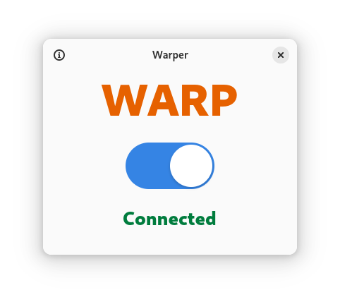

  

# Warper

Manage WARP connection

  

GUI for managing Cloudflare `warp-cli`. Written in `C` using `libadwaita`.

**IMPORTANT**: [warp-cli](https://developers.cloudflare.com/warp-client/get-started/linux/) must be installed on your system first.

### Build flatpak using GNOME Builder

1. Install [GNOME Builder](https://flathub.org/apps/org.gnome.Builder).
2. Click "Clone Repository" with `https://github.com/mrvladus/Warper.git` as the URL.
3. Click on the build button at the top.
